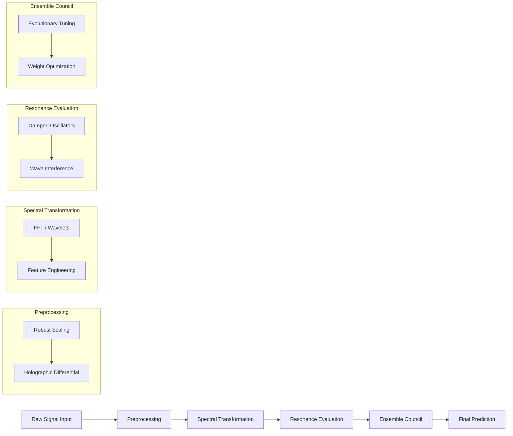

# HRF Pipeline Overview: End-to-End Processing

This document describes the end-to-end processing pipeline of the **Harmonic Resonance Fields (HRF)** framework, specifically focusing on how physiological signals (like EEG) are transformed into precise classifications.

## 1. High-Level Flowchart

The following flowchart visualizes the data flow through the HRF system:

---

## 2. Step-by-Step Pipeline Stages

### Stage 1: Data Acquisition & Input
The pipeline begins with multi-channel time-series data. In research applications, this is typically **EEG (Electroencephalogram)** data consisting of microvolt-level brainwave recordings.

### Stage 2: Preprocessing (The Holographic Differential)
To prepare noisy biological signals for analysis, HRF employs two key techniques:
- **Robust Scaling**: Uses quantile-based normalization (typically 15th-85th percentile) to reject sensor artifacts and outliers without losing the underlying signal structure.
- **Bipolar Montage (Holographic Differential)**: Inspired by clinical neurophysiology, this involves calculating the difference between adjacent sensor channels. This cancels out "common-mode" noise that affects all sensors equally, isolating the local neural activity.

### Stage 3: Spectral Transformation
Time-domain signals are often chaotic. HRF transforms them into the frequency domain using **Fast Fourier Transform (FFT)** or similar spectral methods. This makes the signal **phase-invariant**, meaning the system can detect an "Alpha wave" regardless of exactly when it started relative to the recording window.

### Stage 4: Resonance Evaluation (The Wave Potential)
This is the core innovation of HRF. Each training data point is treated as a source of a "wave potential." The system calculates how much a new test point "resonates" with these sources using the formula:

$$ \Psi(\mathbf{x}, \mathbf{p}_i) = \exp\left(-\gamma \left\| \mathbf{x} - \mathbf{p}_i \right\|^2\right) \cdot \cos\left(\omega_c\cdot \left\| \mathbf{x} - \mathbf{p}_i \right\| + \varphi\right) $$

- **Gaussian Damping**: Limits the influence of distant data points.
- **Harmonic Resonance**: Measures the frequency match between the signal and the class prototype.

### Stage 5: The Council of 26 (Ensemble Optimization)
The **G.O.D. Optimizer** (General Omni Dimensional Optimizer) manages a council of 26 (or 14 in legacy versions) diverse algorithmic units.
1. **Evolutionary Tuning**: The "Soul" units (resonance kernels) undergo a brief evolutionary phase where parameters like frequency ($\omega_c$) and damping ($\gamma$) are mutated to find the optimal physical laws for the specific dataset.
2. **Weight Optimization**: The system uses a constrained optimization (SLSQP) to assign weights to each unit based on their performance on a validation subset. This ensures that the most reliable "experts" have the most influence on the final result.

### Stage 6: Final Prediction
The weighted resonance energies from all council members are aggregated. The class with the highest total "resonance energy" is selected as the final prediction.

---

## 3. Why this works for EEG
EEG signals are inherently oscillatory (Alpha, Beta, Gamma waves). By modeling classification as a resonance problem rather than a set of "if-then" logic rules (like standard Decision Trees), HRF naturally aligns with the underlying physics of brainwaves, leading to the benchmark-breaking **98.84% accuracy**.
