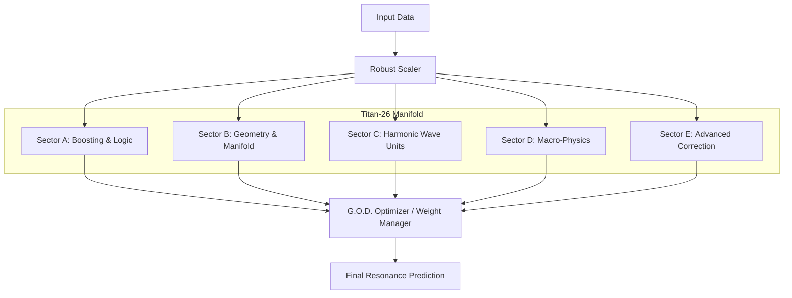

# HRF Architecture: The Titan-26 Unified Manifold

This document provides a technical overview of the **Harmonic Resonance Fields (HRF)** system architecture, focusing on the **Titan-26** unified manifold(Current implementatiion includes 16 operational units).

## 1. Architectural Philosophy

HRF moves beyond traditional statistical machine learning by treating classification as a physical wave interference problem. The architecture is designed to be **physics-informed**, meaning it uses physical laws (like damping and resonance) to model data relationships.

The core of the system is the **Titan-26 Manifold**, a 26-dimensional integration of diverse physical and statistical topologies.

## Overview

HRF Titan-26 represents the 26-dimensional extension of the HRF architecture, combining:
- Classical ML ensembles
- Geometric/topological models
- Harmonic wave-based units
- Macro-physical modeling layers
- Advanced neural architectures

All components are dynamically orchestrated by the G.O.D. (General Omni Dimensional) Optimizer.


## 2. Titan-26 Architectural Flow
### ASCII Diagram
```text

                               +----------------------+
                               |     Input Data       |
                               +----------+-----------+
                                          |
                                          v
                               +----------------------+
                               |     Robust Scaler    |
                               +----------+-----------+
                                          |
                                          v
       ---------------------------------------------------------------------------
       |                |                  |                   |                 |
       v                v                  v                   v                 v

+-------------+  +----------------+  +---------------+  +-------------+  +----------------+
| Sector-A:   |  |  Sector-B :    |  |   Sector-C:   |  |  Sector-D:  |  |  Sector-E:     |
| Classical & |  | Geometric &    |  |               |  | Macro-      |  |                |
| boosting    |  | Topological    |  | Harmonic Wave |  | Physical    |  | Advanced       |
| Topologies  |  | Manifolds      |  | Units         |  | Layers      |  | Architectures  |
+------+------+  +--------+-------+  +--------+------+  +------+------+  +--------+-------+
       |                 |                  |                 |                  |
       |                 |                  |                 |                  |
       v                 v                  v                 v                  v

  ExtraTrees       Polynomial SVM      RBF Resonance       Entropy          Fractal Mirror
  Random Forest    KNN Local/Global    Twin Resonance      Gravity          Omega Neural ELM
  XGBoost          QDA                 Soul Kernels        Quantum          Residual Units

      ------------------------------------------------------------------------------
                                          |
                                          v
                     +---------------+--------------------------+
                     |       G.O.D. Optimizer Engine            |
                     |   (General Omni Dimensional Optimizer)   |
                     +--------------------+---------------------+
                                          |
                                          v
                            +----------+-----------------+
                            |          Output            |
                            | Final Resonance Prediction |
                            +----------------------------+
```


## 3. Visual Architecture Diagram




## 4. The Titan-26 Manifold

The "26 dimensions" refer to 26 distinct algorithmic units or "fields" that are orchestrated by the **G.O.D. (General Omni Dimensional) Optimizer**. These units are categorized into five major sectors:

### Sector A: Classical & Boosting Topologies
These units handle the "particle-like" aspects of data—discrete decision boundaries and statistical splitting.
1. **ExtraTrees Ensemble**: High-variance randomized trees for robust baseline.
2. **Random Forest**: Standard bagging for variance reduction.
3. **Histogram Gradient Boosting**: Fast, bin-based gradient boosting.
4. **XGBoost Deep**: Deep gradient boosted trees for complex patterns.
5. **XGBoost Fast**: Shallow gradient boosted trees for speed.

### Sector B: Topological & Geometric Manifolds
These units focus on the "shape" and distance metrics of the feature space.
6. **Nu Warp**: Nonlinear manifold warping (NuSVC).
7. **Polynomial SVM**: Captures curved relationships.
8. **KNN Local**: Micro-geometric locality.
9. **KNN Regional**: Macro-geometric structures.
10. **QDA**: Quadratic Spacetime Modeling for curved density.

### Sector C: Harmonic Wave Units
The heart of HRF, these units model data as wave potentials.
11. **RBF Resonance**: Radial Basis Function kernels.
12. **Soul Original**: The primary Holographic Resonance unit.
13. **TwinA Resonance**: Chaotic-seeded mirror soul.
14. **TwinB Resonance**: Order-seeded mirror soul.
15. **Wave Dimension D**: Higher-order harmonic field.
16. **Wave Dimension E**: Higher-order harmonic field.
17. **Wave Dimension F**: Higher-order harmonic field.

### Sector D: Macro-Physical Layers
Experimental layers that map data to physical constants and phenomena.
18. **Golden Phi**: Biological spiral mapping.
19. **Entropy Modeling**: Information theory-based stability.
20. **Quantum Superposition**: Probabilistic state modeling.
21. **Gravity Potential**: Inverse-square law attraction.
22. **Omega Point**: Ultimate convergence trajectory.

### Sector E: Advanced Architectures
High-precision correction and specialized filters.
23. **Fractal Mirror**: Self-similar recursive mapping.
24. **Dimension Z**: Latent space representation.
25. **Omega Neural ELM**: Extremely fast neural projection.
26. **Death Ray Sniper**: High-precision residual error correction.

---


## 5. Repository Structure

For new contributors, here is how the project is organized:

```text
.
├── prototypes/                  # Early prototypes and benchmarks
├── docs/                        # Documentation and Monograph
├── HRF Codes/                   # Applied HRF (EEG, Conference papers)
├── HRF-Engine/                  # Core HRF algorithm implementations
│   ├── HRF 21D/                 # Legacy 21-dimensional version
│   ├── HRF 26D/                 # Stable 26-dimensional version
│   └── Generalized_HRF_V2.ipynb # Current production engine
├── Research Paper/              # Published papers and whitepapers
├── README.md                    # Project introduction
├── CONTRIBUTING.md              # Contribution guidelines
├── AGENTS.md                    # Guidelines for AI/Agents
└── SECURITY.md                  # Security policy
```

- **HRF-Engine/** is where the core logic resides. If you want to modify the algorithm, look here.
- **HRF Codes/** contains Jupyter notebooks and scripts for specific datasets like EEG.
- **docs/** is where you can find detailed mathematical explanations (the Monograph).
